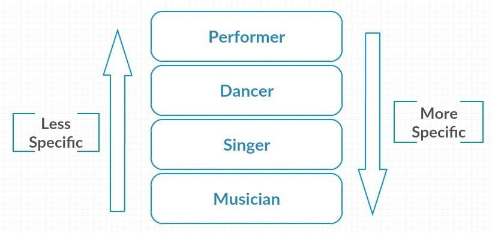

## Mixin
kelas mixin bersifat stack atau bertumpuk. Kelas-
kelas ini berurutan dari yang paling umum hingga paling spesifik. Sehingga sesuai
urutan mixin di atas kelas Musician akan menampilkan method dari Singer karena berada di
urutan terakhir atau paling spesifik.

